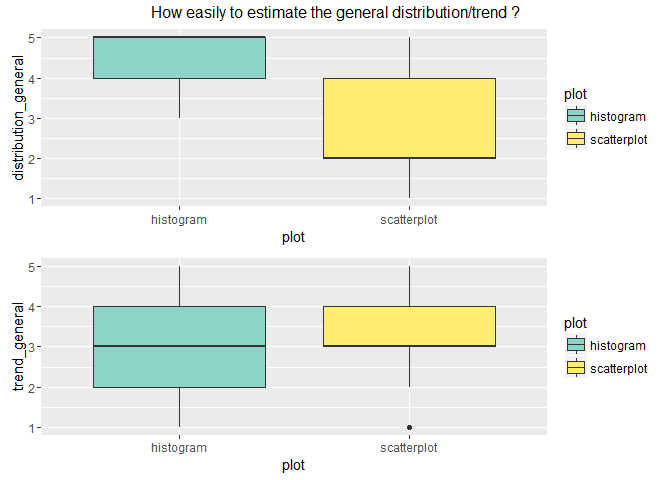
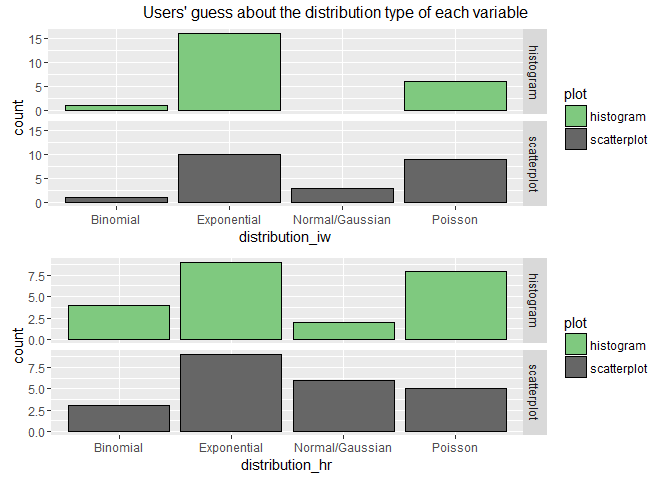
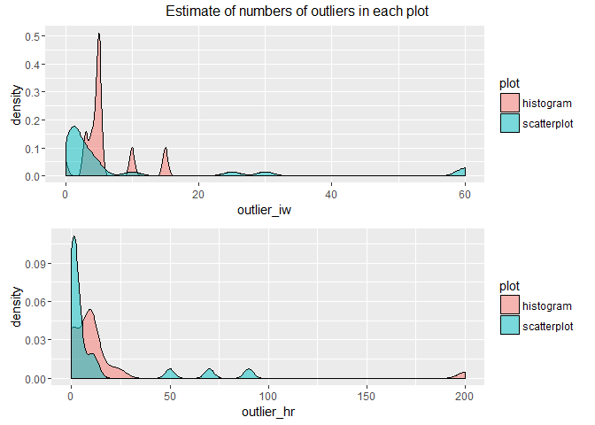
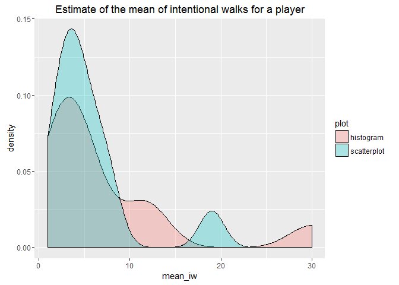
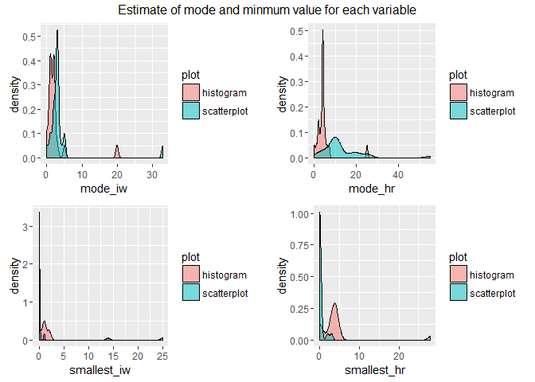
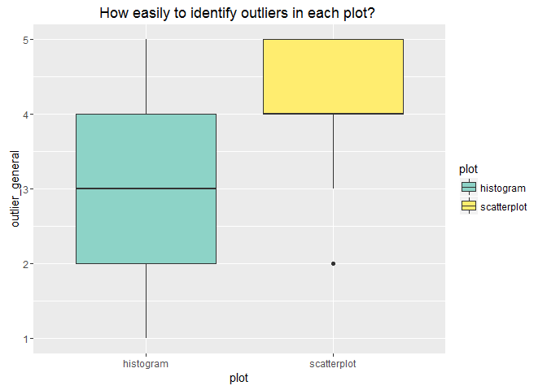

### 0.Motivation

Different forms of data visualization convey different insights to certain dataset. We designed a survey about obtaining information between a histogram and a scatterplot, then collected 23 MDS classmates' survey feedback. We mainly focus on presenting two variables(intentional walk & home runs) sourced from the batting table of the Lahman R package (<http://cran.us.r-project.org/web/packages/Lahman/Lahman.pdf>) for the Toronto Blue Jays team for all years in the dataset (1977 - 2015).

### 1.Preparation: Import and clean the survey data

```
# convert character variables into factor variables
survey_data <- survey_data %>%
  mutate(plot = as.factor(plot),
         distribution_iw = as.factor(distribution_iw),
         distribution_hr = as.factor(distribution_hr))

# present the top 5 rows of the tidy dataset
survey_data %>%
  head(5)
```

### 2.Visualization: encoding the users' answers into graphs

<p style="float: left; font-size: 9pt; text-align: center; width: 48%; margin-right: 1%; margin-bottom: 1em; margin-top: 1em;" class = "large"> comparing trend accessibility </p>


<p style="float: left; font-size: 9pt; text-align: center; width: 48%; margin-right: 1%; margin-bottom: 1em; margin-top: 1em;" class = "large"> comparing distribution accessibility </p>

<p style="float: left; font-size: 9pt; text-align: center; width: 48%; margin-right: 1%; margin-bottom: 1em; margin-top: 1em;" class = "large"> comparing estimates of  the number of outlier </p>

<p style="float: left; font-size: 9pt; text-align: center; width: 48%; margin-right: 1%; margin-bottom: 1em; margin-top: 1em;" class = "large"> comparing estimates of the mean </p>

<p style="float: left; font-size: 9pt; text-align: center; width: 48%; margin-right: 1%; margin-bottom: 1em; margin-top: 1em;" class = "large"> comparing estimates of the mode and minimum </p>

<p style="float: left; font-size: 9pt; text-align: center; width: 48%; margin-right: 1%; margin-bottom: 1em; margin-top: 1em;" class = "large"> comparing outlier recognition </p>

### 3.Conclusions

- Histogram is more effective in conveying distribution/trend and mode.

- Scatterplot is more effective in outlier and relationship.
